# IoT Shepherd

**IoT Shepherd** is a unified framework for secure and intelligent IoT management. It combines:

- **CGM (Manuals RAG):** embeds IoT manuals (PDFs) into a vector database and answers admin questions using retrieved context.
- **ADM (Traffic Anomaly Detection):** analyzes IoT traffic (PCAP → features → fine-tuned BERT) and produces an **Incident Card** and report artifacts.
- **Shepherd (Mitigation Agent):** takes an Incident Card, retrieves relevant manual evidence, and generates **operator-ready mitigation guidance** (web search is used only if enabled).

---

## 📁 Directory Structure

```text
IoT-Shepherd/
│
├── README.md
├── requirements.txt
│
├── rag_module/
│   ├── populate_database.py
│   ├── query.py
│   ├── performance.py
│   ├── get_embedding_function.py
│   ├── example_data/
│   └── chroma/
│
├── Bert/
│   ├── feature_extraction.py
│   ├── bert_multiclass_train.py
│   ├── bert_multiclass_test.py
│   ├── performance_metrics.py
│   ├── saved_model/                 # (not committed) generated during evaluation
│   └── bert_traffic_report.txt
│
├── shepherd_gui/                    # GUI codebase (CGM + ADM + Shepherd)
│   ├── app.py
│   ├── pages/
│   ├── src/iot_shepherd/
│   ├── data/manuals/                # manuals PDFs (CGM)
│   ├── models/adm_bert/             # (not committed) copy model here for GUI ADM
│   ├── storage/chroma_sessions/     # persisted Chroma sessions
│   └── runs/                        # per-run ADM outputs
│
└── assets/                          # images for GitHub README
    └── screenshots/
        ├── 1.png
        ├── 2.png
        ├── 3.png
        ├── 4.png
        ├── 5.png
        ├── 6.png
        ├── 7.png
        ├── agent_running.png
        ├── agentic_page.png
        ├── incident_summary.png
        ├── pcap_analysis.png
        ├── settings.png
        └── traffic_analysis.png
```

---

## ⚙️ Installation

> **Note:** This project uses [Ollama](https://ollama.com) for local LLMs and embedding models.

1) **Clone the repository**
```bash
git clone https://github.com/WadElla/iot-shepherd.git
cd iot-shepherd
```

2) **Create a virtual environment (recommended)**
```bash
conda create -n shepherd python=3.10 -y
conda activate shepherd
```

3) **Install required packages**
```bash
pip install -r requirements.txt
```

4) **Start Ollama + pull required models**

Start Ollama:
```bash
ollama serve
```

In a separate terminal, pull models:
```bash
ollama pull llama3.2:latest
ollama pull nomic-embed-text
```

(Optional) DuckDuckGo search support:
```bash
pip install ddgs
```

---

## 🚀 Usage

### 1) Launch the GUI
```bash
cd shepherd_gui
streamlit run app.py
```

### 2) Use the Shepherd GUI (quick flow)

**Step 1 — Build the Knowledge Base (CGM)**
1. Open **Knowledge Base**.
2. Upload IoT manuals (PDFs).
3. Click **Run indexing**.
4. Confirm the chunk count is > 0.

**Step 2 — Run Traffic Analysis (ADM)**
1. Open **Traffic Analysis**.
2. Upload a PCAP (or PCAPNG).
3. Click **Analyze PCAP** to generate:
   - `incident_card.json`
   - `bert_traffic_report.txt`
   - `adm_predictions.csv`

**Step 3 — Ask Shepherd (Mitigation)**
1. Open **Ask Shepherd**.
2. Load the latest Incident Card (or upload one).
3. Click **Generate mitigation** to receive manual-grounded guidance.
4. (Optional) Enable web search if you want external evidence when manuals are insufficient.

---

## 🧪 Evaluation

IoT Shepherd includes an evaluation workflow for both **ADM (BERT anomaly detection)** and **CGM (RAG)**.

### A) ADM Evaluation (Anomaly Detector)

**Purpose:** Assess the fine-tuned BERT model’s performance on IoT traffic classification and generate a reusable saved model.

**Location:**
```text
Bert/
├── bert_multiclass_train.py
├── bert_multiclass_test.py
├── performance_metrics.py
└── saved_model/   (generated)
```

**Run (train + test):**
```bash
cd Bert
python bert_multiclass_train.py
python bert_multiclass_test.py
```

**Generates:**
- `saved_model/` (fine-tuned model artifacts)
- `bert_traffic_report.txt`
- evaluation plots/metrics (depending on your scripts)

> **Note (model size):** The fine-tuned BERT model is **not committed** to the repository due to size.  
> After running ADM evaluation/training, copy the generated `Bert/saved_model/` into:
> `shepherd_gui/models/adm_bert/` so the GUI ADM can load it.

---

### B) CGM / RAG Evaluation

**Purpose:** Evaluate manuals-grounded question answering (e.g., response quality and retrieval settings).

**Location:**
```text
rag_module/
├── performance.py
└── (evaluation inputs/output folders as defined in your setup)
```

**Run:**
```bash
cd rag_module
python performance.py
```

**Generates:**
- evaluation scores (e.g., BLEU/ROUGE/METEOR/BERTScore if enabled in your script)
- system metrics and logs (depending on your `performance.py` implementation)

---

## 📸 IoT Shepherd UI Screenshots

<details open>
  <summary><b>📸 Click to view UI screenshots</b></summary>

  <p align="center">
    <a href="assets/screenshots/1.png">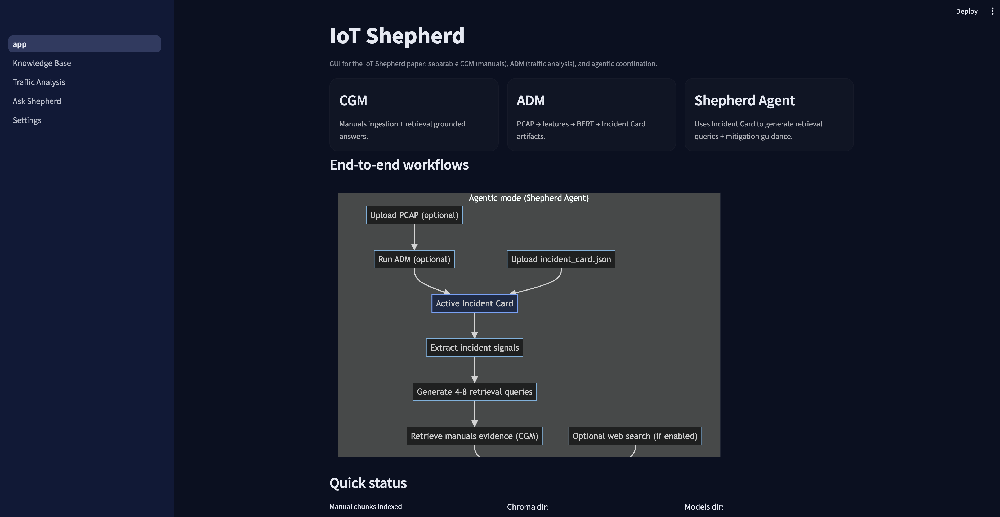</a>
    <a href="assets/screenshots/2.png">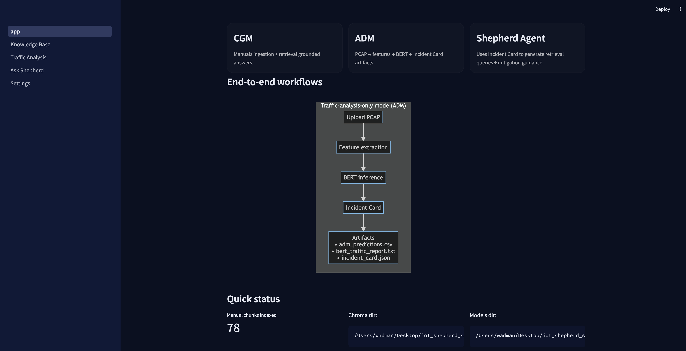</a>
    <a href="assets/screenshots/3.png">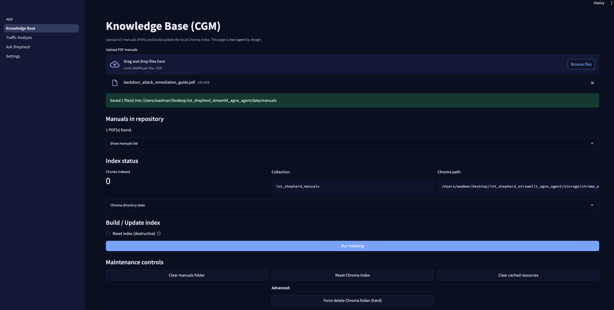</a>
  </p>

  <p align="center">
    <a href="assets/screenshots/4.png">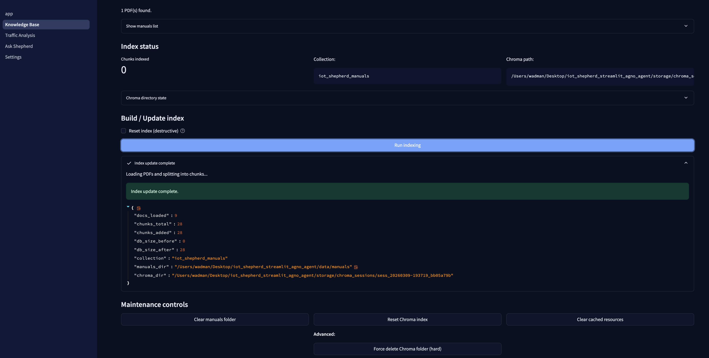</a>
    <a href="assets/screenshots/5.png">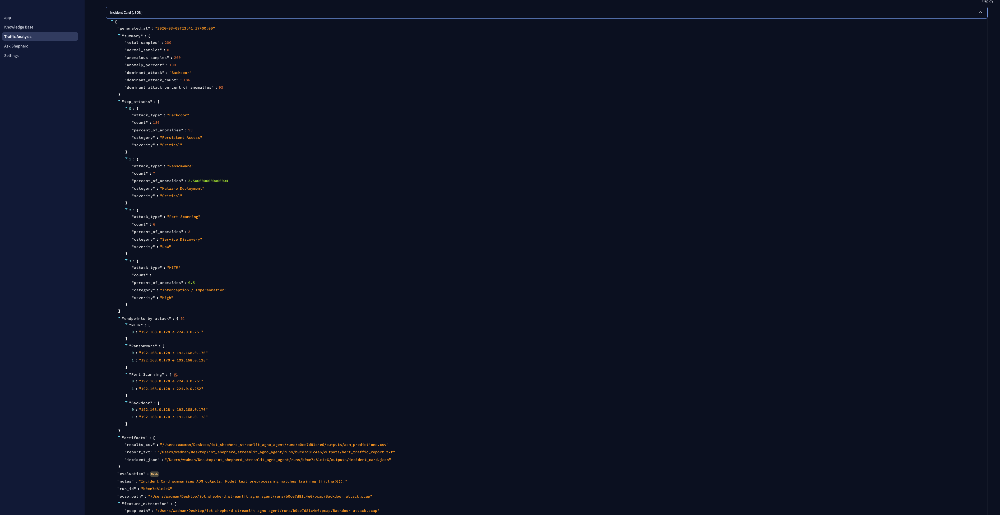</a>
    <a href="assets/screenshots/6.png">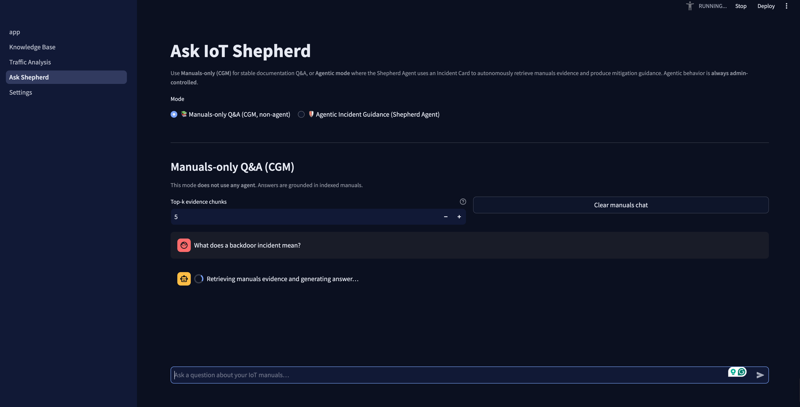</a>
  </p>

  <p align="center">
    <a href="assets/screenshots/7.png">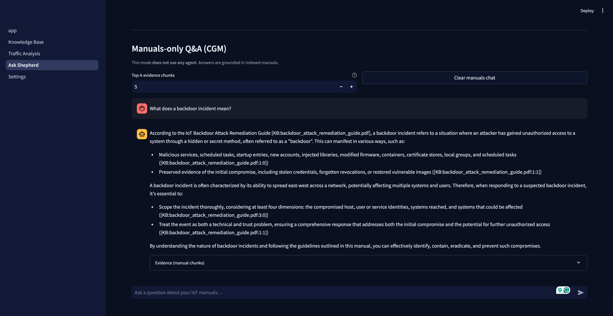</a>
    <a href="assets/screenshots/agent_running.png">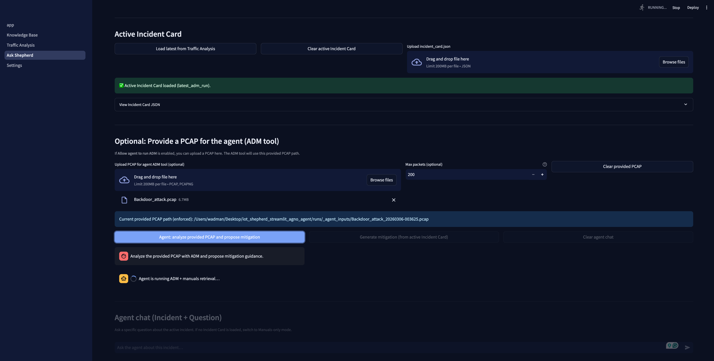</a>
    <a href="assets/screenshots/agentic_page.png">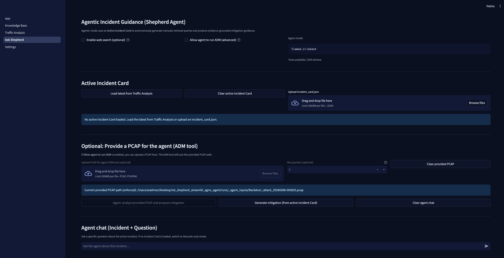</a>
  </p>

  <p align="center">
    <a href="assets/screenshots/incident_summary.png">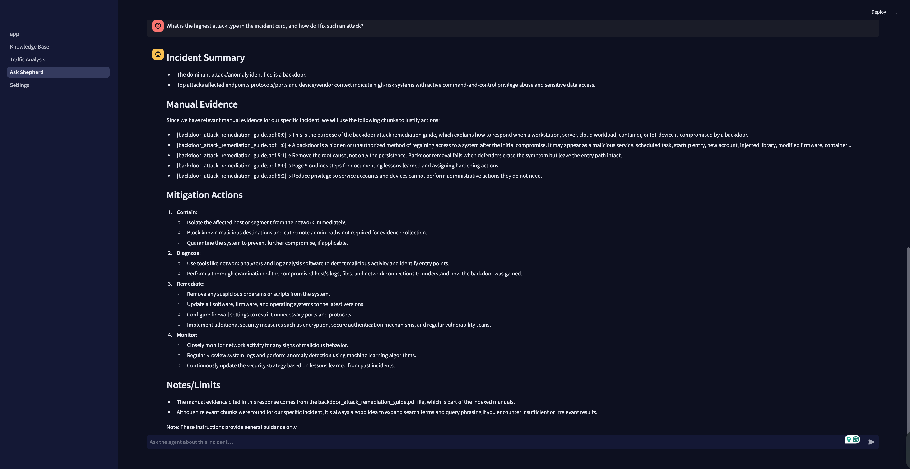</a>
    <a href="assets/screenshots/pcap_analysis.png">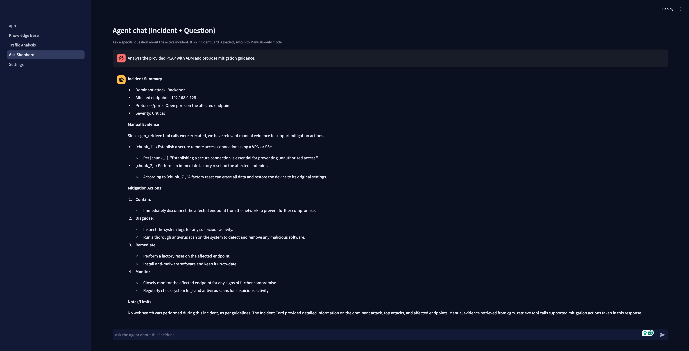</a>
    <a href="assets/screenshots/settings.png">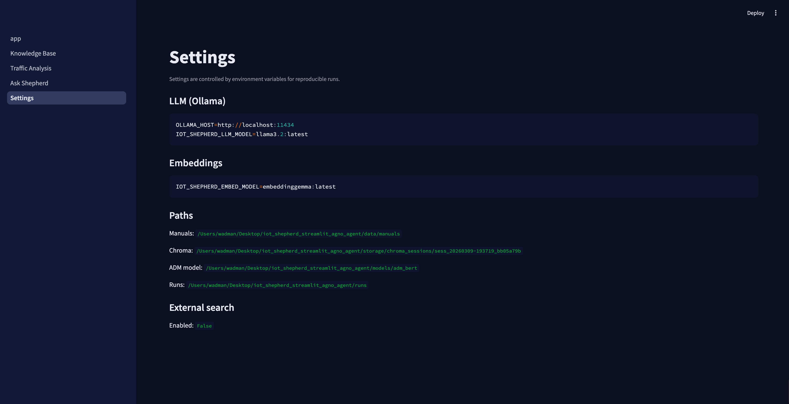</a>
  </p>

  <p align="center">
    <a href="assets/screenshots/traffic_analysis.png">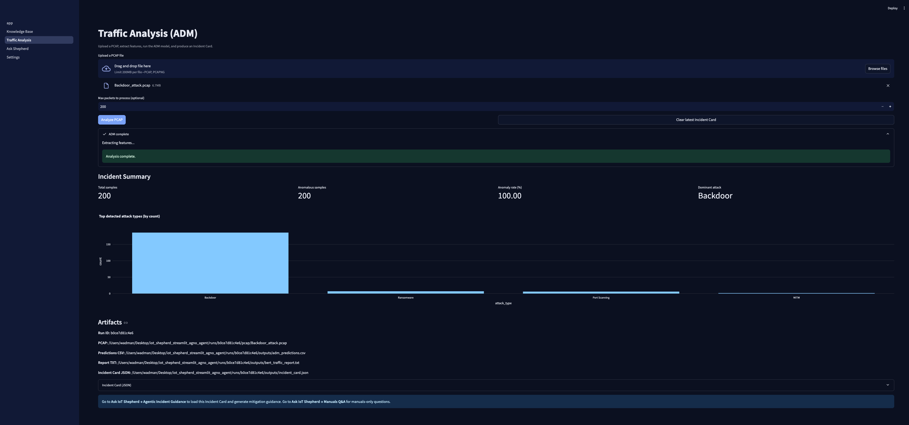</a>
  </p>
</details>

